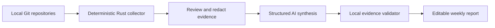

# DevWeek

> A local-first desktop app that turns reviewed Git evidence into an auditable weekly report.

DevWeek started with a mundane problem: every Friday I had to reconstruct a week of engineering work from memory and scattered Git logs. Copying commits into a chat window helped, but it still required repetitive collection, exposed too much context by default, and made polished AI claims difficult to verify.

DevWeek makes the reliable parts deterministic and gives the synthesis work to AI.

## What makes it different

- **Evidence before prose.** Git history is collected locally, filtered by date and author, and shown for review before any model request.
- **Auditable generation.** Every completed-work claim must cite a real evidence ID. Unsupported claims are removed by a local validator.
- **A deliberate privacy boundary.** Repository paths are never sent to the provider, excluded commits stay local, and API keys live in memory only.
- **Use the model you already have.** DevWeek can reuse an authenticated local Codex or Claude Code installation without copying credentials. It also supports bring-your-own-key (BYOK) access to DeepSeek, OpenAI, and other OpenAI-compatible providers, as well as local endpoints such as Ollama.
- **An editable last mile.** The validated Markdown remains fully editable and can be copied for Markdown or Feishu.

## Product flow



The AI provider receives commit subjects, relative filenames, dates, and diff statistics only after review. It does not receive absolute repository paths. A report item without a valid citation is not rendered.

## Trust model

DevWeek treats model output as untrusted input. A report crosses three explicit boundaries before it is ready to use:

1. **Collection boundary.** Git commands run on the developer's machine. The developer reviews the collected commits, removes anything irrelevant or sensitive, and decides what may leave the device. Absolute repository paths are stripped before generation.
2. **Generation boundary.** The provider receives only the reviewed evidence and a structured output contract. The model can organize and summarize that evidence, but it cannot create new sources of truth.
3. **Validation boundary.** The generated report returns to a local validator. Completed-work claims with missing or unknown evidence IDs are removed, and the remaining Markdown stays editable so the developer makes the final call.

This separation keeps exact work—Git execution, identity and date filtering, redaction, and citation checking—in deterministic code while using a model only for the part that benefits from synthesis.

## Architecture

| Layer | Responsibility |
| --- | --- |
| React + TypeScript | Four-step workflow, evidence review, editable report |
| shadcn/ui + Radix UI | Accessible UI primitives without changing the original visual direction |
| Zustand | Session state and non-secret local preferences |
| Tauri + Rust | Native folder selection, safe Git execution, model HTTP requests, isolated local-agent CLI execution |
| Evidence validator | Rejects unknown citations and unsupported completed-work items |

Git is executed with an argument array through `std::process::Command`; repository paths are never interpolated into a shell command. Tauri capabilities expose only the native folder picker—filesystem and shell plugin permissions are not granted.

## Run locally

Prerequisites: Node.js 22+, pnpm 10+, Rust stable, and the [Tauri system dependencies](https://v2.tauri.app/start/prerequisites/) for your operating system.

```bash
pnpm install
pnpm tauri dev
```

Then:

1. Add one or more local Git repositories.
2. Confirm the detected Git identity in Settings.
3. Select a time range and review the collected commits.
4. Exclude anything that should not be sent to the model.
5. Choose a detected local agent or configure an HTTP model, then generate the report.

For Ollama, use an OpenAI-compatible endpoint such as `http://localhost:11434/v1`; an API key is not required.

### Local agents

Choose **Codex (local)** or **Claude Code (local)** to reuse a CLI installation that is already signed in. DevWeek checks `CODEX_BIN` or `CLAUDE_BIN`, `PATH`, common package-manager locations, and the Codex app bundle on macOS. If detection succeeds, no API key is entered, copied, or persisted by DevWeek.

Each local-agent report runs as an ephemeral, non-interactive process in an empty temporary directory and receives reviewed evidence through stdin rather than command-line arguments. Codex uses `codex exec` with a read-only sandbox, approvals disabled, and repository rules and user configuration ignored. Claude Code uses print mode and safe mode when supported. Older compatible versions use an OAuth-preserving fallback that requests hooks disabled and turns off CLAUDE.md and auto-memory, tools, user MCP servers, browser integration, slash commands, background updates, and session persistence. Claude is prompted to return JSON without requiring gateway-specific structured-output support, and the result still passes through DevWeek's local schema and evidence validator before display.

If an agent is installed but not authenticated, run the corresponding command:

```bash
codex login
claude auth login
```

## Quality gates

```bash
pnpm check
pnpm test:rust
```

The test suite covers calendar boundaries, evidence exclusion, hallucinated citation rejection, explicit user-context attribution, Git numstat parsing, identity filtering, compatible endpoint construction, Codex sandbox arguments and JSONL completion handling, and Claude Code isolation arguments and structured output handling. GitHub Actions runs both frontend and Rust checks for every pull request.

## Current scope

Version 0.1 focuses on a trustworthy single-user desktop workflow. It intentionally does not add account systems, cloud storage, repository hosting APIs, or team dashboards. Good next steps are streaming structured output, OS keychain integration, signed desktop releases, and carefully bounded adapters for other local agents.

## Contributing

Please read [AGENTS.md](./AGENTS.md) before changing product behavior. In particular, preserve the current visual direction, keep API keys out of persistence, and add tests for any change to the evidence boundary.

## License

[Apache License 2.0](./LICENSE)
