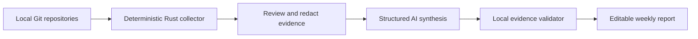

# DevWeek

> A local-first desktop app that turns reviewed Git evidence into an auditable weekly report.

DevWeek started with a mundane problem: every Friday I had to reconstruct a week of engineering work from memory and scattered Git logs. Copying commits into a chat window helped, but it still required repetitive collection, exposed too much context by default, and made polished AI claims difficult to verify.

DevWeek makes the reliable parts deterministic and gives the synthesis work to AI.

## What makes it different

- **Evidence before prose.** Git history is collected locally, filtered by date and author, and shown for review before any model request.
- **Auditable generation.** Every completed-work claim must cite a real evidence ID. Unsupported claims are removed by a local validator.
- **A deliberate privacy boundary.** Repository paths are never sent to the provider, excluded commits stay local, and API keys live in memory only.
- **Bring your own model.** DeepSeek, OpenAI, Ollama, and other OpenAI-compatible endpoints use the same structured generation contract.
- **An editable last mile.** The validated Markdown remains fully editable and can be copied for Markdown or Feishu.

## Product flow



The AI provider receives commit subjects, relative filenames, dates, and diff statistics only after review. It does not receive absolute repository paths. A report item without a valid citation is not rendered.

## Product principles

### Build without permits

DevWeek requires no GitHub OAuth app, organization integration, webhook, or company rollout. A developer selects a local repository and gets value immediately. The product came from a real personal workflow and can be shipped end to end by one engineer.

### It's all about taste

The important product decision is the boundary: automation should remove Friday's recall work without taking away editorial control. Evidence review happens before the external call; AI output is validated before display; the final report remains editable. Loading, empty, privacy, and failure states follow the existing visual language instead of growing into a settings-heavy developer tool.

### AI is the default tool

AI is the primary synthesis engine, not a decorative feature. At the same time, tasks that require exactness—Git execution, author filtering, date calculation, redaction, and citation validation—remain deterministic. This division makes the model useful without asking the user to trust it blindly.

## Architecture

| Layer | Responsibility |
| --- | --- |
| React + TypeScript | Four-step workflow, evidence review, editable report |
| shadcn/ui + Radix UI | Accessible UI primitives without changing the original visual direction |
| Zustand | Session state and non-secret local preferences |
| Tauri + Rust | Native folder selection, safe Git execution, model HTTP requests |
| Evidence validator | Rejects unknown citations and unsupported completed-work items |

Git is executed with an argument array through `std::process::Command`; repository paths are never interpolated into a shell command. Tauri capabilities expose only the native folder picker—filesystem and shell plugin permissions are not granted.

## Run locally

Prerequisites: Node.js 22+, pnpm 10+, Rust stable, and the [Tauri system dependencies](https://v2.tauri.app/start/prerequisites/) for your operating system.

```bash
pnpm install
pnpm tauri dev
```

Then:

1. Add one or more local Git repositories.
2. Confirm the detected Git identity in Settings.
3. Select a time range and review the collected commits.
4. Exclude anything that should not be sent to the model.
5. Configure an AI provider and generate the report.

For Ollama, use an OpenAI-compatible endpoint such as `http://localhost:11434/v1`; an API key is not required.

## Quality gates

```bash
pnpm check
pnpm test:rust
```

The test suite covers calendar boundaries, evidence exclusion, hallucinated citation rejection, explicit user-context attribution, Git numstat parsing, identity filtering, and compatible endpoint construction. GitHub Actions runs both frontend and Rust checks for every pull request.

## Current scope

Version 0.1 focuses on a trustworthy single-user desktop workflow. It intentionally does not add account systems, cloud storage, repository hosting APIs, or team dashboards. Good next steps are streaming structured output, OS keychain integration, signed desktop releases, and provider-specific adapters where OpenAI compatibility is insufficient.

## Contributing

Please read [AGENTS.md](./AGENTS.md) before changing product behavior. In particular, preserve the current visual direction, keep API keys out of persistence, and add tests for any change to the evidence boundary.

## License

[Apache License 2.0](./LICENSE)
